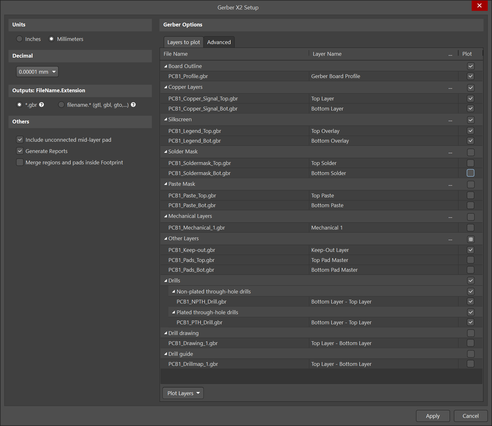
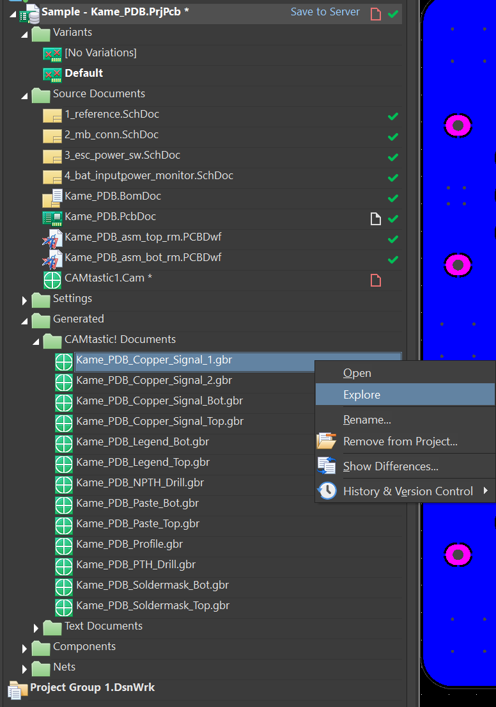

# BYU ECEn Shop Altium Fabrication Instructions

1) File>>Fabrication Outputs>>Gerber X2 Files

2) Make sure the boxes checked match those in "Layers_to_include"

3) Then just hit "apply"
4) There will be a folder that appears named 'CAMtastic! Documents'. Right click one of the files with the extension ".gbr" and press 'Explore'. This will open the file explorer. Zip all of the files in the opened folder and submit the zip file.
